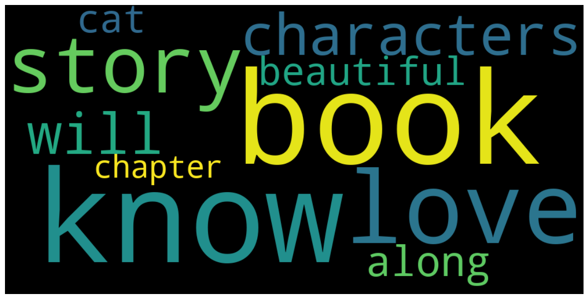
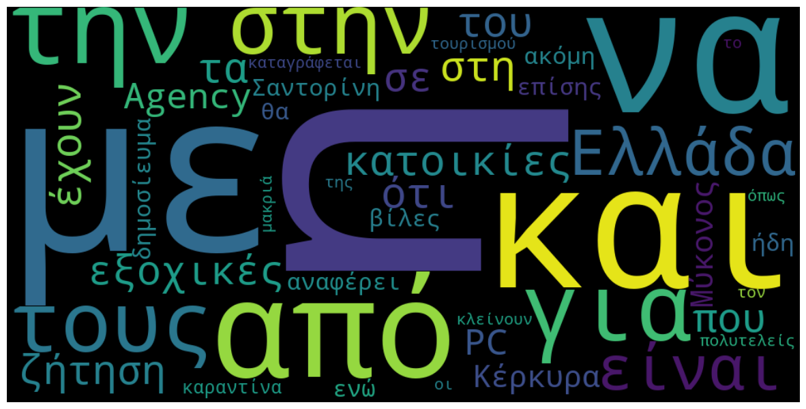

# In functions.py offers the following functions
1. sum_of_paragraphs : Returns the total sum of paragraphs
2. sum_of_sentences : Returns the total sum of sentences
3. tokenization : Returns tokenize a string
4. sum_of_distinct_word_types : Proceed into POS tagging
5. token_frequency : List of word frequency counts
6. remove_stop_words : Remove stop words from a given tokenize list

# Install dependencies
In order to install the required dependencies, you have to run the following command at root level.

pip install -r requirements.txt

# Generate Results
In order to generate the Results, you should run the processor.py which is located in root level, the generated results is 
located in generatedFiles/results.txt

# World Cloud 
With the usage of the WordCloud library I generate the World Cloud image, in order to display the 50 most frequent words 
Image located in generatedFiles/word_cloud_en.png or word_cloud_el.png

